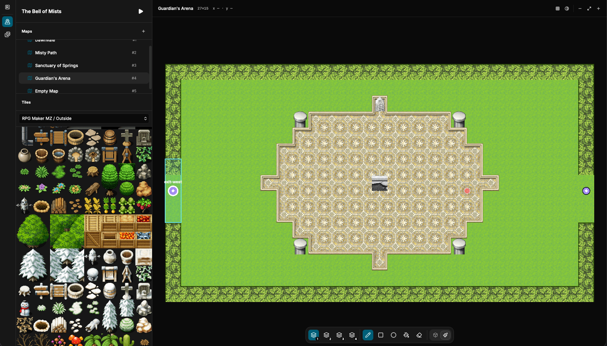
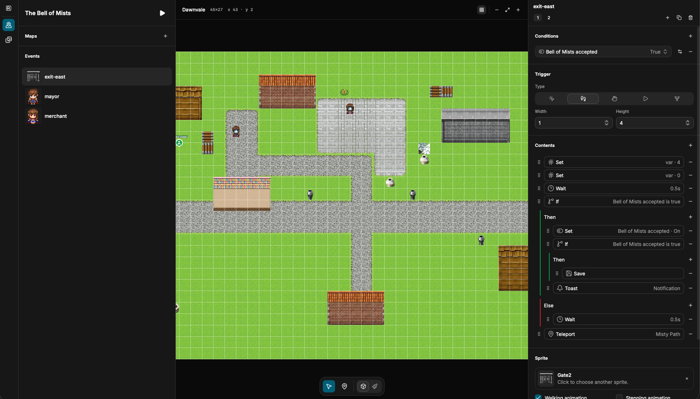

# RPG Crafter

**A modern, web-based RPG Maker clone for building and playing 2D action RPGs.**





RPG Crafter reimagines the familiar RPG Maker workflow for the web. It combines a visual game editor, a browser-based runtime, and a portable JSON game format in a single open-source project. The goal is to make creating, testing, and sharing an RPG feel immediate: edit a project in the Studio, click **Play**, and run it directly in the browser.

The project takes inspiration from RPG Maker's approachable, data-driven authoring experience while modernizing the technology and workflow. RPG Crafter is independently developed and does not use RPG Maker source code or proprietary assets.

> [!WARNING]
> RPG Crafter is a work in progress. Features, file formats, and editor behavior may change without notice.

> [!IMPORTANT]
> RPG Crafter is an independent project. It is not affiliated with, endorsed by, or sponsored by Gotcha Gotcha Games, KADOKAWA, or the owners of the RPG Maker trademark. “RPG Maker” is used only to describe the type of product and the project's inspiration.

## Why RPG Crafter?

- **Web-based:** the editor and player run in a modern browser.
- **Fast iteration:** launch the game from the Studio and test changes immediately.
- **Visual authoring:** create maps, paint terrain, place events, and configure navigation without editing engine code.
- **Data-driven games:** maps, actors, enemies, skills, items, quests, events, and UI configuration live in validated JSON files.
- **Portable projects:** export a standalone ZIP containing the complete game package and its assets.
- **Modern stack:** React, TypeScript, PixiJS, Vite, Zod, and pnpm workspaces.
- **Renderer-independent runtime:** gameplay rules and save data are kept separate from the PixiJS renderer.

## Current features

RPG Crafter currently includes:

- a three-panel Studio with a map hierarchy, canvas, and property inspector;
- layered top-down maps with multiple overlapping gameplay planes;
- terrain painting and A1/A2/A4 autotile, A5, or arbitrary 48 px grid tileset imports;
- per-cell and per-edge collision editing;
- explicit navigation connections between floors, bridges, roofs, and other overlapping surfaces;
- visual event placement with conditional pages and reusable JSON actions;
- dialogue, choices, quests, switches, inventory, healing, notifications, and teleportation;
- real-time combat with melee attacks, dashes, projectiles, area attacks, and multi-phase bosses;
- local browser saves and Studio drafts backed by IndexedDB;
- keyboard and touch controls;
- project validation, automated tests, and production builds across the monorepo.

The repository also contains a small reference game demonstrating the editor, runtime, combat system, events, quests, layered maps, and navigation model.

## Project structure

```text
rpgcrafter/
├── apps/
│   ├── studio/          # React-based visual editor
│   └── player/          # PixiJS game runtime
├── packages/
│   └── game-schema/     # Shared types, validation, migrations, and navigation
├── content/
│   └── reference-game/  # Example game package
├── assets/              # Reference sprites and tilesets
└── scripts/             # Development tooling
```

The Studio and Player are separate applications. Both consume the same game-package format defined by `packages/game-schema`.

## Getting started

### Requirements

- A current LTS version of Node.js
- pnpm 10

### Install and run

```bash
pnpm install
pnpm start
```

This uses Turborepo to start both applications in parallel:

- the Studio at <http://localhost:4174>;
- the Player at <http://localhost:4173>.

In the Studio, choose **File > Open…** to load the bundled reference game. The **Play** button opens a validated preview in a new browser tab.

You can also run each application separately:

```bash
pnpm dev:studio
pnpm dev:player
```

## Development commands

```bash
pnpm check   # Type-check all workspaces
pnpm test    # Run the test suites
pnpm build   # Build every application and package
```

## How game projects work

A game project is a portable package of JSON documents and assets. The Studio can open or export the package as a ZIP archive, while the bundled reference game uses the same structure directly from `content/reference-game/`.

```text
my-game/
├── manifest.json
├── tilesets.json
├── maps.json
├── actors.json
├── enemies.json
├── skills.json
├── items.json
├── quests.json
├── ui.json
├── events.json
├── initial-state.json
├── tilesets/
│   └── ...             # Tileset images and per-project configurations
└── sprites/
    └── ...             # Event character sheets
```

All 11 JSON documents are required at the root of an imported archive. `manifest.json` identifies the game, declares its schema and compatible engine versions, and selects the starting map. The remaining documents define tilesets, maps, the player, enemies, skills, items, quests, UI, objectives, and initial state.

Maps contain planes, tile layers, navigation, events, and enemy spawns. Event pages combine triggers, conditions, movement settings, and reusable commands such as dialogue, inventory changes, quest updates, teleports, and movement routes. The engine contains no scenario-specific logic, so the Studio and Player consume the same data-driven project format.

Asset paths are relative to the project root. Imported and exported packages include referenced tileset PNG files, tileset configuration JSON files, and event sprite sheets alongside the core documents. Before a project is opened or played, RPG Crafter migrates supported older data and validates document structure, engine compatibility, cross-document references, map navigation, and required assets.

## Controls

| Action | Keyboard |
| --- | --- |
| Move | `WASD` or arrow keys |
| Interact | `E` |
| Attack | `Space` |
| Dash | `K` |
| Special abilities | `L` and `I` |
| Save | `Ctrl/Command + S` |
| Restart | `R` |
| Developer grid | `F2` |

## Project status

RPG Crafter is under active development and is not yet a drop-in replacement for RPG Maker. The current version focuses on the core workflow: editing maps and events, managing assets, previewing a project, and running a complete action-RPG reference game in the browser.

File formats and editor behavior may still change between releases. If you build a project with the current version, keep the source package under version control.

## Trademark notice

RPG Maker is a trademark of its respective owners. RPG Crafter is an independent open-source project and is not affiliated with the RPG Maker product or its publishers. All other trademarks belong to their respective owners.
